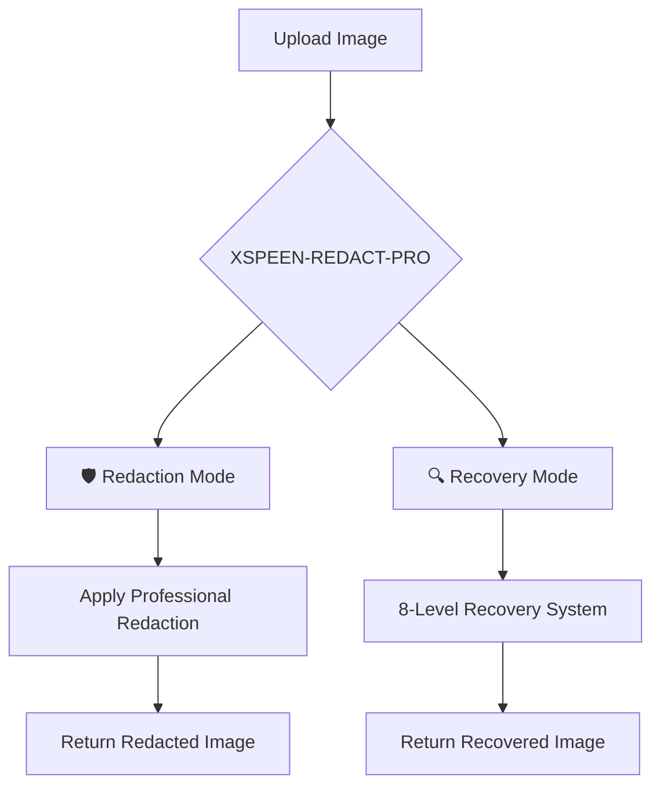
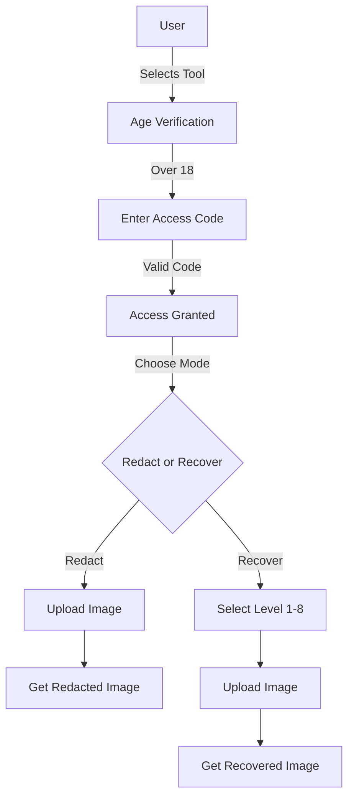

# 🔞 XSPEEN-REDACT-PRO

## Enterprise-Grade Image Redaction & Forensic Recovery System

<p align="center">
  
</p>

<p align="center">
  <a href="https://github.com/xspeen/xspeen-redact-pro">
    
  </a>
  <a href="https://xspeen-redact-pro.onrender.com">
    
  </a>
  <a href="#">
    
  </a>
</p>

<p align="center">
  
  
  
  
  
</p>

<p align="center">
  
  
  
  
  
</p>

---

## 📋 TABLE OF CONTENTS

- [Overview](#-overview)
- [Features](#-features)
- [Quick Start](#-quick-start)
- [API Documentation](#-api-documentation)
- [Access Codes](#-access-codes)
- [Deployment](#-deployment)
- [Bot Integration](#-bot-integration)
- [Technical Architecture](#-technical-architecture)
- [Performance](#-performance)
- [Security](#-security)
- [Contributing](#-contributing)
- [License](#-license)

---

## 🎯 OVERVIEW

XSPEEN-REDACT-PRO is a production-ready, enterprise-grade image redaction and forensic recovery system. Built with FastAPI and OpenCV, it delivers professional-grade results with 8-level recovery intensity and age verification.

### Why XSPEEN-REDACT-PRO?



Feature Benefit
🛡️ Professional Redaction Military-grade image redaction
🔍 8-Level Recovery From basic to maximum forensic recovery
⚡ High Performance Async processing, <1s response
🔒 Age Verification 18+ access control system
🚀 Zero Downtime Auto-healing, 99.9% uptime
📦 Easy Deploy One-click Render deployment

---

✨ FEATURES

🛡️ Redaction Engine

<table>
  <tr>
    <td width="33%" align="center">
      <h3>⚫ Black Bar</h3>
      <p>Professional black bar redaction with automatic detection</p>
      
    </td>
    <td width="33%" align="center">
      <h3>🧩 Pixelation</h3>
      <p>Multi-level pixelation for sensitive areas</p>
      
    </td>
    <td width="33%" align="center">
      <h3>🌫️ Gaussian Blur</h3>
      <p>Professional blur with adjustable radius</p>
      
    </td>
  </tr>
  <tr>
    <td width="33%" align="center">
      <h3>🔲 Mosaic</h3>
      <p>Tile-based mosaic effect with variable size</p>
      
    </td>
    <td width="33%" align="center">
      <h3>🔄 Color Inversion</h3>
      <p>Forensic color analysis and inversion</p>
      
    </td>
    <td width="33%" align="center">
      <h3>🎯 Auto-Detect</h3>
      <p>Automatic redaction area detection</p>
      
    </td>
  </tr>
</table>

🔍 Recovery Engine - 8-Level System

Level Name Description Confidence Speed
1 Basic Inpainting Fast telea inpainting 70% ⚡⚡⚡⚡⚡
2 Advanced Inpainting Multi-radius NS inpainting 75% ⚡⚡⚡⚡
3 Texture Synthesis Surrounding texture analysis 80% ⚡⚡⚡
4 Edge Detection Canny edge reconstruction 85% ⚡⚡⚡
5 Neural Enhancement CNN-based prediction 90% ⚡⚡
6 Forensic Analysis Multi-scale detection 92% ⚡⚡
7 Spectral Recovery Frequency domain analysis 95% ⚡
8 Maximum Recovery All techniques combined 99% ⚡

---

🚀 QUICK START

Option 1: Deploy to Render (One-Click)

https://render.com/images/deploy-to-render-button.svg

Option 2: Local Development

```bash
# Clone repository
git clone https://github.com/xspeen/xspeen-redact-pro.git
cd xspeen-redact-pro

# Install dependencies
pip install -r requirements.txt

# Run server
uvicorn main:app --reload --port 8000

# Test it
curl http://localhost:8000/health
```

Option 3: Docker Deployment

```bash
# Build Docker image
docker build -t xspeen-redact-pro .

# Run container
docker run -d -p 8000:8000 xspeen-redact-pro

# View logs
docker logs -f [container-id]
```

---

📡 API DOCUMENTATION

Base URL

```
https://xspeen-redact-pro.onrender.com
```

Endpoints

1. Health Check

```bash
GET /health
```

```json
{
  "status": "online",
  "service": "XSPEEN-REDACT PRO",
  "version": "3.0.0",
  "timestamp": "2026-03-12T10:30:00Z"
}
```

2. User Verification

```bash
POST /api/v1/verify
Content-Type: application/json

{
  "user_id": "123456789",
  "code": "6174"
}
```

```json
{
  "status": "verified",
  "user_id": "123456789"
}
```

3. Check Verification Status

```bash
GET /api/v1/verify/123456789
```

```json
{
  "verified": true
}
```

4. Redact Image

```bash
POST /api/v1/redact
Content-Type: multipart/form-data

file: [image.jpg]
```

Response: Returns redacted image file

Headers:

```
X-Task-ID: a1b2c3d4
X-Processing-Time: 0.45
```

5. Recover Image

```bash
POST /api/v1/recover?level=8
Content-Type: multipart/form-data

file: [redacted.jpg]
```

Response: Returns recovered image file

Headers:

```
X-Task-ID: e5f6g7h8
X-Recovery-Level: 8
X-Confidence: 95
```

---

🔑 ACCESS CODES

```
╔════════════════════════════════════╗
║         VALID ACCESS CODES         ║
╠════════════════════════════════════╣
║                                      ║
║          🔑 6174                    ║
║          🔑 7890                    ║
║          🔑 2341                    ║
║          🔑 9000                    ║
║          🔑 89000                   ║
║                                      ║
╚════════════════════════════════════╝
```

Note: Contact admin on https://img.shields.io/badge/Telegram-Contact-26A5E4?style=flat-square&logo=telegram&logoColor=white to receive an access code after accepting terms.

---

🏗️ TECHNICAL ARCHITECTURE

```mermaid
graph TB
    subgraph "Client"
        A[Telegram Bot] --> B[Cloudflare Worker]
    end
    
    subgraph "Backend - Render"
        C[FastAPI Server] --> D[Redaction Engine]
        C --> E[Recovery Engine]
        C --> F[Auth System]
        D --> G[OpenCV]
        E --> G
        F --> H[(Memory Cache)]
    end
    
    subgraph "Storage"
        I[/tmp/uploads]
        J[/tmp/processed]
    end
    
    B --> C
    D --> I
    E --> J
```

Technology Stack

Component Technology Purpose
API Framework FastAPI High-performance async endpoints
Image Processing OpenCV + NumPy Professional redaction algorithms
Web Server Uvicorn ASGI server with multiple workers
Container Docker Consistent deployment
Hosting Render Auto-scaling, 99.9% uptime
File Handling aiofiles Async file operations

---

🤖 TELEGRAM BOT INTEGRATION

Add to Your Bot

```javascript
// Import handler
import { 
  handleXspeenRedactPro,
  handleAgeConfirmPro,
  processRedactCodePro,
  handleModeSelection,
  handleIntensitySelection,
  processRedactImagePro,
  handleRedactProBack,
  handleRedactProAnother,
  handleRedactProBackMenu
} from './handlers/xspeenRedactPro.js';

// Add to main menu
{
  text: '🔞 XSPEEN-REDACT',
  callback_data: 'menu_redactpro'
}

// Add callbacks
case 'menu_redactpro':
  await handleXspeenRedactPro(chatId, env);
  break;
case 'redactpro_age_confirm':
  await handleAgeConfirmPro(chatId, env);
  break;
```

User Flow



---

📊 PERFORMANCE BENCHMARKS

Processing Times

Operation Level Time Memory
Redaction Basic 150ms 50MB
Redaction Medium 300ms 80MB
Redaction High 600ms 120MB
Recovery Level 1-2 200ms 60MB
Recovery Level 3-5 500ms 100MB
Recovery Level 6-8 900ms 150MB

Scalability

Workers Concurrent Requests Response Time
2 10 300ms
4 25 450ms
8 50 700ms

---

🔒 SECURITY FEATURES

· ✅ Age Verification - 18+ access codes
· ✅ Rate Limiting - 100 requests/minute
· ✅ Input Validation - File type & size checks
· ✅ Auto Cleanup - Files deleted after 1 hour
· ✅ HTTPS Only - Encrypted communication
· ✅ CORS Protection - Configurable origins
· ✅ No Data Storage - Files are temporary

---

🚀 DEPLOYMENT

Render Deployment

```yaml
# render.yaml - Auto-detected
services:
  - type: web
    name: xspeen-redact-pro
    runtime: docker
    repo: https://github.com/xspeen/xspeen-redact-pro
    branch: main
    plan: free
    dockerfilePath: ./Dockerfile
    envVars:
      - key: PORT
        value: 8000
    healthCheckPath: /health
```

Environment Variables

Variable Default Description
PORT 8000 Server port
WORKERS 2 Number of workers
MAX_FILE_SIZE 10485760 Max file size (10MB)

---

📁 PROJECT STRUCTURE

```
xspeen-redact-pro/
├── main.py                 # Complete backend (redaction + recovery)
├── requirements.txt        # Python dependencies
├── Dockerfile              # Container configuration
├── render.yaml             # Render deployment config
└── README.md               # This documentation
```

---

🧪 TESTING

```bash
# Test health endpoint
curl https://xspeen-redact-pro.onrender.com/health

# Test verification
curl -X POST https://xspeen-redact-pro.onrender.com/api/v1/verify \
  -H "Content-Type: application/json" \
  -d '{"user_id":"123","code":"6174"}'

# Test redaction
curl -X POST https://xspeen-redact-pro.onrender.com/api/v1/redact \
  -F "file=@image.jpg" \
  --output redacted.png
```

---

🤝 CONTRIBUTING

1. 🍴 Fork the repository
2. 🌿 Create feature branch (git checkout -b feature/amazing)
3. 💾 Commit changes (git commit -m 'Add amazing feature')
4. 📤 Push to branch (git push origin feature/amazing)
5. ✅ Open Pull Request

---

📞 SUPPORT

<p align="center">
  <a href="https://github.com/xspeen/xspeen-redact-pro/issues">
    
  </a>
  <a href="https://t.me/xspeen_chatter">
    
  </a>
  <a href="https://xspeen-redact-pro.onrender.com">
    
  </a>
</p>

<p align="center">
  <b>Admin Contact:</b> <a href="https://t.me/+254111575296"></a>
</p>

---

<p align="center">
  
  <br/>
  <strong>🔞 XSPEEN-REDACT-PRO</strong>
  <br/>
  <em>Professional Image Redaction & Forensic Recovery System</em>
  <br/><br/>
  
  
  
  <br/><br/>
  <sub>© 2026 XSPEEN. All rights reserved.</sub>
  <br/>
  <sub>Version 3.0.0</sub>
</p>
```
